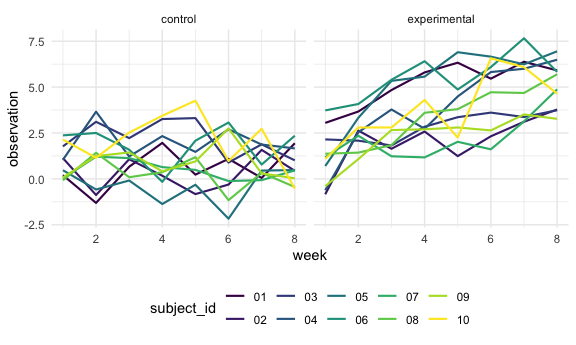
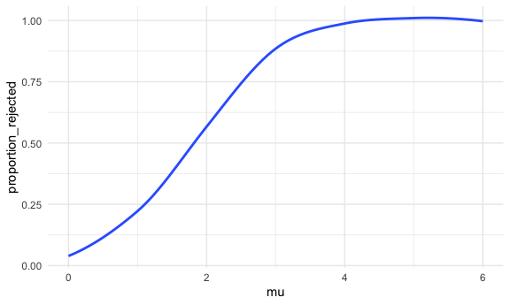
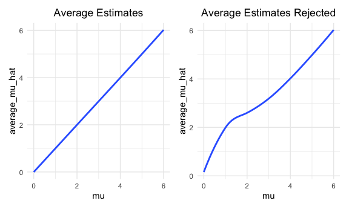

P8105 Homework 5
================
Rebekah Hughes

## Problem 1

The raw data on homicides in US cities from the Washington Post includes
information on homicide cases, including names of individuals killed,
the name of the city and state, the coordinates of the homicide, date of
report, and what the disposition was for each case. There is also an id
variable for the case.

The following code creates a `city_state` variable and determines the
number of unsolved and solved homicides within cities depending on
disposition.

``` r
homicide_df =
  read_csv("./hom-data/homicide-data.csv") %>% 
  mutate(
    city_state = str_c(city, state, sep = "_"),
    resolved = case_when(
      disposition == "Closed without arrest" ~ "unsolved",
      disposition == "Open/No arrest" ~ "unsolved",
      disposition == "Closed by arrest" ~ "solved",
    )
  ) %>% 
  select(city_state, resolved) %>% 
  filter(city_state != "Tulsa_AL")
```

The following code chunks filter the data down to the homicides that are
unsolved and run a proportion test to determine the proportion of
homicides that are unsolved in Baltimore, MD specifically.

``` r
aggregate_df =
  homicide_df %>% 
  group_by(city_state) %>% 
  summarize(
    hom_total = n(),
    hom_unsolved = sum(resolved == "unsolved")
  )
```

``` r
prop.test(
  aggregate_df %>% filter(city_state == "Baltimore_MD") %>% pull(hom_unsolved),
  aggregate_df %>% filter(city_state == "Baltimore_MD") %>% pull(hom_total)) %>% 
  broom::tidy()
```

    ## # A tibble: 1 x 8
    ##   estimate statistic  p.value parameter conf.low conf.high method    alternative
    ##      <dbl>     <dbl>    <dbl>     <int>    <dbl>     <dbl> <chr>     <chr>      
    ## 1    0.646      239. 6.46e-54         1    0.628     0.663 1-sample… two.sided

The following code determines the proportion of unsolved homicides in
each city and pulls the confidence interval and the proportion from the
data.

``` r
results_df =
  aggregate_df %>% 
  mutate(
    prop_tests = map2(.x = hom_unsolved, .y = hom_total, ~prop.test(x = .x, n = .y)),
    tidy_tests = map(.x = prop_tests, ~broom::tidy(.x))
  ) %>% 
  select(-prop_tests) %>% 
  unnest(tidy_tests) %>% 
  select(city_state, estimate, conf.low, conf.high)
```

The below code chunk creates a plot with the proportion of unsolved
homicides and accompanying confidence intervals for each of the cities
in the data.

``` r
results_df %>% 
  mutate(city_state = fct_reorder(city_state, estimate)) %>% 
  ggplot(aes(x = city_state, y = estimate)) +
  geom_point() +
  geom_errorbar(aes(ymin = conf.low, ymax = conf.high)) +
  theme(axis.text.x = element_text(angle = 90, vjust = 0.5, hjust = 1))
```


## Problem 2

The data used for this problem contains information on individuals
separated in the control or the experimental arms of a study. The
individual data is contained in separate csv files. The following code
brings the files together into one data frame and tidies the resulting
data.

``` r
path_df =
  tibble(
    path = list.files("lda-data/")
) %>% 
  mutate(path = str_c("lda-data/", path),
         data = map(path, read_csv)) %>% 
  unnest(data) %>% 
  pivot_longer(
    week_1:week_8,
    names_to = "week",
    names_prefix = "week_",
    values_to = "observation") %>% 
  separate(path, c("data1", "data2", "arm", "subject_id", "file")) %>% 
  mutate(
    study_arm = case_when(
      arm == "con" ~ "control",
      arm == "exp" ~ "experimental"),
    week = as.numeric(week)) %>% 
  select(-data1, -data2, -file, -arm) %>% 
  relocate(study_arm)
```

The following plot uses the data frame created above to display
observations on each subject over time. The plot is divided into the
control arm and the experimental arm.

``` r
path_df %>% 
  ggplot(aes(x = week, y = observation, color = subject_id)) +
  geom_line(size = 0.75) +
  facet_grid(. ~ study_arm)
```



Drawing from the above plot, the control group appears to have fairly
stable observations over time. The experimental group, overall, appears
to have increasing observations over time. Both of the study arms appear
to start in a similar place with their observations and appear to
diverge between weeks 2 and 3. The control group overall dips much lower
than the experimental group ever does as well.

## Problem 3

In the following code chunk, a function is created in which there is a
tibble with a normal distribution created and a `t.test` function is
included to be applied to the later code that uses the function.

``` r
sim_hyp_test = function(sampsize = 30, mu, sigma = 5){
  
  sim_data = 
    tibble(
      x = rnorm(n = sampsize, mean = mu, sd = sigma)
    )
  
  sim_data %>% 
    t.test() %>% 
    broom::tidy()
}
```

The below code forms a list using the function from above, runs a
simulation, and binds the rows of the output together. The simulation is
run 5000 times for the mu value of 0.

``` r
output = vector("list", 5000)

for (i in 1:5000) {
  output[[i]] = sim_hyp_test(mu = 0)
}

sim_results = bind_rows(output)
```

The following code uses the function and the simulation that were
created and run in the above two code chunks to run another simulation
and create a data frame for the `t.test` function when mu includes the
values of 0 through 6. The resulting data frame has 5000 rows for each
of the mu values and contains a variable for the estimate of mu for each
sample, named `mu_hat` in the data frame.

``` r
sim_results = 
  tibble(mu = c(0, 1, 2, 3, 4, 5, 6)) %>% 
  mutate(
    output_lists = map(.x = mu, ~rerun(5000, sim_hyp_test(mu = .x))),
    estimate_dfs = map(output_lists, bind_rows)) %>% 
  select(-output_lists) %>% 
  unnest(estimate_dfs) %>% 
  mutate(mu_hat = estimate) %>% 
  select(-estimate)
```

The following code creates a plot showing the relationship between the
true value of mu and the proportion of times the null was rejected, or
the power of the test.

``` r
sim_results %>% 
  mutate(
    rejected_null = case_when(
      p.value <= 0.05 ~ "yes",
      p.value > 0.05 ~ "no")) %>% 
  group_by(mu, rejected_null) %>% 
  filter(rejected_null == "yes") %>% 
  count(rejected_null) %>%
  summarise(
    proportion_rejected = sum(n)/5000) %>% 
   ggplot(aes(x = mu, y = proportion_rejected)) + 
   geom_smooth(se = FALSE)
```



Given the above plot, it can be determined that as the true value of mu
increases, the power also increases until mu = 3 and then it plateaus.
Therefore, the power of the tests increase until mu = 3 and then remains
about the same until starting to decrease slightly at mu = 6.

The following code creates two plots and binds them together. The first
plot, shown on the left, displays the relationship between the true
value of mu and the average estimate of mu. The second plot, shown on
the right, displays the relationship between the true value of mu and
the average estimate of mu for samples only where the null was rejected.

``` r
average_mu_plot = 
  sim_results %>% 
  group_by(mu) %>% 
  summarize(
    average_mu_hat = mean(mu_hat)
  ) %>% 
  ggplot(aes(x = mu, y = average_mu_hat)) +
  ggtitle("Average Estimates") +
  theme(plot.title = element_text(hjust = 0.5)) +
  geom_smooth(se = FALSE)

average_reject_mu_plot =
  sim_results %>% 
  filter(p.value <= 0.05) %>% 
  group_by(mu) %>% 
  summarize(
    average_mu_hat = mean(mu_hat)
  ) %>% 
  ggplot(aes(x = mu, y = average_mu_hat)) +
  ggtitle("Average Estimates Rejected") +
  theme(plot.title = element_text(hjust = 0.5)) +
  geom_smooth(se = FALSE)

average_mu_plot + average_reject_mu_plot
```



Given the above plots, it can be determined that the average sample
values of mu for only the samples in which the null was rejected (shown
on the right) is not exactly the same as the overall average estimates
of mu (shown on the left). There are visible deviations from the average
estimates when only the samples where the null was rejected were
included at mu = 0, 1, 2, and 3. The average estimates for only the
samples where the null is rejected are slightly higher, excluding when
mu = 4, 5, and 6, where the average estimates look about the same on
both plots.
